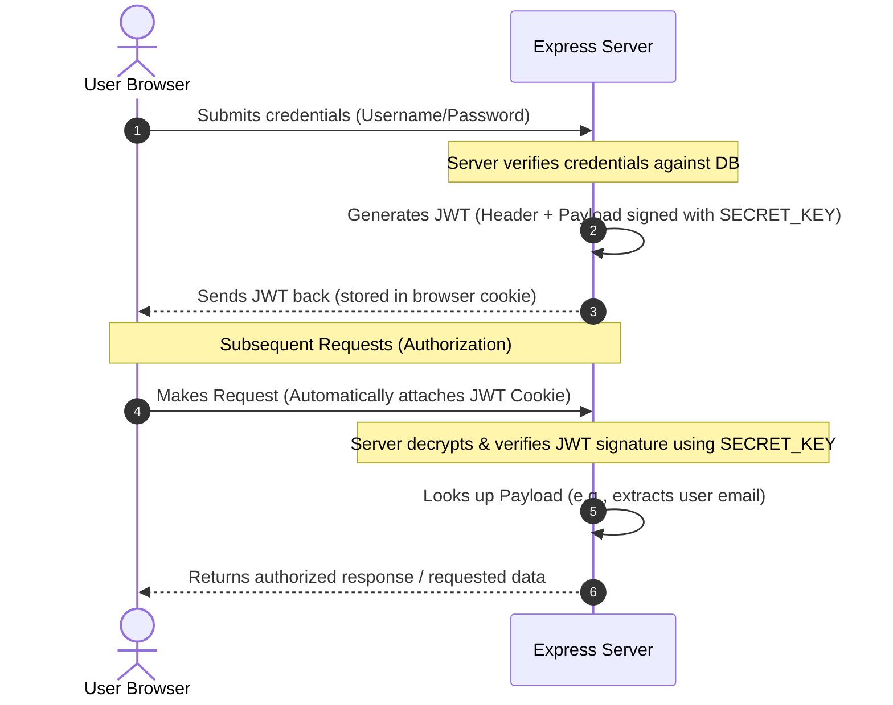

# Auth & Authorization (Simplified! )

Welcome to the simplified guide to Authentication, Authorization, Cookies, Sessions, and JWT! This guide breaks down the core concepts and provides setup instructions along with code examples to get you started.

---

## 1. Authentication vs Authorization: What's the difference?

> [!NOTE]
> ### Authentication (Who are you? )
> When an unknown user wants to open/access their account, they have to prove they are actually the owner of that account.
> * **How it works:** They provide credentials (like email and password).
> * **The check:** If these match what is in the Database (DB), we grant access!
> * **In simple words:** Checking if a user is a valid user and has the right to access the system.

> [!TIP]
> ### Authorization (What can you do? )
> Once a user is logged in, we check what actions they are actually allowed to perform on the website.
> * **Example:** A user wants to edit a profile.
> * **The check:** Does this user have the ownership/rights to edit this profile?
>   * **Yes?** --> Allow the edit!
>   * **No?** --> Deny access. They are not authorized to make those changes.

---

## 2. The Big Problem: Servers are Forgetful! 

HTTP is **stateless**. Normally, when a browser (**Chrome**) talks to a server, the server treats every single request as completely new:

```text
[Express Server]                                      [Chrome Browser]
                                                   
  login id & password?     <-----------------------   Requests to login
  
  Okay, authenticated!    ----------------------->   Sends credentials
  
  (Seconds later...)
  Who are you again?      <-----------------------   Requests profile page
```

Because the server forgets who you are immediately, we use **Cookies and Sessions** or **JSON Web Tokens (JWT)** to keep you logged in.

---

## 3. How Cookies & Tokens Save the Day! 

Instead of making you login on every click, the server gives Chrome a secret key (a **Token**) after a successful login. Chrome stores this key and automatically attaches it to every future request.

### The Authentication Flow:

```mermaid
sequenceDiagram
    autonumber
    actor Chrome as Chrome Browser
    participant Server as Express Server
    database DB as Database (MongoDB)

    Note over Chrome, Server: 1. Authentication (Login)
    Chrome->>Server: POST /login { email, password }
    Server->>DB: Find user by email
    DB-->>Server: User details (with hashed password)
    Server->>Server: Verify password using bcrypt.compare()
    
    Note over Server: 2. Token Generation & Cookie Set
    Server->>Server: Generate JWT Token (contains user ID)
    Server-->>Chrome: Access granted! (Set cookie: token=JWT_STRING)

    Note over Chrome, Server: 3. Subsequent Requests (Authorization)
    Chrome->>Server: GET /profile (Automatically includes cookie)
    Server->>Server: Verify token using jwt.verify()
    Server-->>Chrome: Serve protected profile page
```

---

## 4. Setup Guide 

### Step 1: Install Dependencies
Run these commands in your project terminal:

```bash
# Initialize a new Node.js project
npm init -y 

# Install Express framework & cookie-parser
npm i express cookie-parser

# Install authentication, security, and database tools
npm i jsonwebtoken bcrypt mongoose

# Install Nodemon as a development dependency
npm i -D nodemon
```

### Step 2: Configure `package.json`
Update the `main` script in `package.json` to point to `app.js` and add a start script:
```json
"main": "app.js",
"scripts": {
  "start": "node app.js",
  "dev": "nodemon app.js"
}
```

### Step 3: Useful Browser Extension
Install the **EditThisCookie** extension in your browser (Brave, Chrome, Firefox) to view, edit, and inspect the cookies sent by your server.

---

## 5. Practical Code Examples 

Here is how you actually use these tools in your Express app:

### A. Password Hashing with `bcrypt`
Never store raw passwords in your database! Use `bcrypt` to hash them during registration, and compare them during login.

```javascript
const bcrypt = require('bcrypt');

// 1. Hashing a password (during registration)
async function registerUser(password) {
    const saltRounds = 10;
    const hashedPassword = await bcrypt.hash(password, saltRounds);
    console.log("Hashed Password:", hashedPassword);
    return hashedPassword;
}

// 2. Comparing a password (during login)
async function loginUser(inputPassword, storedHash) {
    const isMatch = await bcrypt.compare(inputPassword, storedHash);
    console.log("Password matches:", isMatch); // returns true or false
}
```

### B. Tokens with `jsonwebtoken` (JWT)
JWTs are used to securely transmit information between client and server as a JSON object.

```javascript
const jwt = require('jsonwebtoken');

const SECRET_KEY = "your_super_secret_key"; // Keep this safe in .env

// 1. Generate (Sign) a Token
const token = jwt.sign({ userId: "12345", email: "user@example.com" }, SECRET_KEY, { expiresIn: '1h' });
console.log("Generated JWT:", token);

// 2. Verify a Token
try {
    const decoded = jwt.verify(token, SECRET_KEY);
    console.log("Decoded Token Data:", decoded);
} catch (err) {
    console.log("Invalid or Expired Token!");
}
```

### C. Setting & Reading Cookies in Express
Using `cookie-parser` middleware to read cookies sent by the browser.

```javascript
const express = require('express');
const cookieParser = require('cookie-parser');
const app = express();

// Use the cookie-parser middleware
app.use(cookieParser());

// Route to set a cookie
app.get("/set-cookie", (req, res) => {
    // res.cookie(name, value, [options])
    res.cookie("token", "your_jwt_token_here", {
        httpOnly: true, // Prevents client-side JS from accessing the cookie (highly secure)
        maxAge: 3600000 // Expires in 1 hour (in milliseconds)
    });
    res.send("Cookie has been set!");
});

// Route to read cookies
app.get("/get-cookie", (req, res) => {
    // Read the cookies sent by the browser
    console.log(req.cookies);
    res.send(`Cookies received: ${JSON.stringify(req.cookies)}`);
});

app.listen(3000, () => console.log("Server running on port 3000"));
```


## 6. Deep Dive: What is a JSON Web Token (JWT)?

> [!NOTE]
> **JWT (JSON Web Token)** is a compact and self-contained way of securely transmitting information between parties as a JSON object. It is digitally signed, making it highly secure and tamper-proof.

### A. The 3 Parts of a JWT
A JWT is represented as a string split into three parts separated by dots (`.`):
`header.payload.signature`

1. **Header (Algorithm & Token Type)**
   * Contains metadata about the token, typically the type of token (`JWT`) and the signing algorithm being used (such as `HMAC SHA256` or `RSA`).
   * *Example:* `{"alg": "HS256", "typ": "JWT"}`
2. **Payload (Data We Store)**
   * Contains the claims (information about the user, like user ID, email, roles, or any other non-sensitive data).
   * *Example:* `{"userId": "12345", "email": "user@example.com"}`
   * > [!WARNING]
     > The payload is encoded (Base64Url), **not encrypted**. Anyone can decode it to view its contents, so **never** store sensitive secrets (like raw passwords) inside the payload!
3. **Signature (The Security Guard)**
   * Ensures that the token hasn't been altered along the way.
   * Created by taking the encoded header, encoded payload, and signing them using a secret key (known only to the server) and the algorithm specified in the header.

---

### B. Detailed Workflow: How JWT Authentication Works

