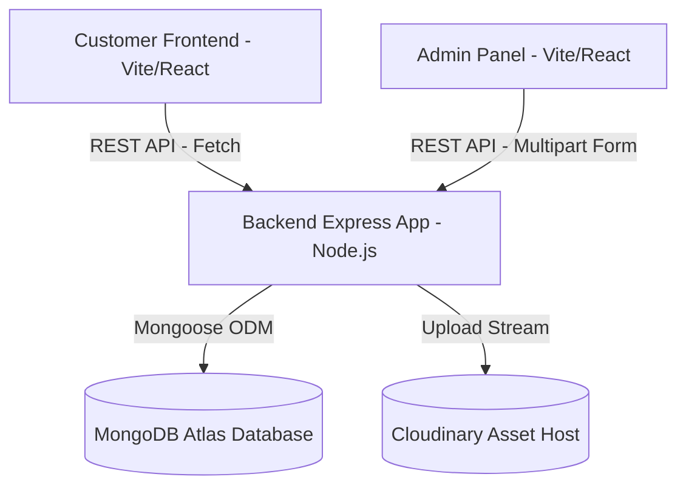

# System Architecture & Developer Documentation (devdocs.md)

Welcome to the technical documentation of the **Etoffe de Luxe** full-stack e-commerce project. This document details the system design, tech stack rationale, data structures, and security configurations.

---

## 🏗️ System Architecture

The application is structured around a decoupled, three-tier architecture that guarantees high separation of concerns, fast frontend page delivery, and database scalability:



*   **Database (Mongoose/MongoDB Atlas)**: Stores user documents, structured order transactions, and catalog metadata.
*   **Media Host (Cloudinary)**: Hosts and compiles product images, optimizing sizes dynamically.
*   **Customer Frontend (Vite/React)**: Restricts guest access. When a valid token is present, it renders grids, search filters, and checkout sheets.
*   **Admin Console (Vite/React)**: Renders inventories tables, upload portals, and shipment status update select controls.

---

## 🛠️ Tech Stack Selection Rationale

| Technology | Role | Rationale for Choice |
| :--- | :--- | :--- |
| **React (v19)** | UI Layer | Component-driven UI rendering, state synchronization, and reactive forms tracking. |
| **Vite (v8)** | Build Tooling | Instant hot module replacement (HMR), extremely fast development building, and static assets bundling. |
| **Tailwind CSS (v4)** | Styling | CSS utility compiling, modern `@import "tailwindcss"` configuration, and fluid layouts. |
| **Node.js / Express** | Web Services | Non-blocking event-driven loop handling asynchronous API connections, files stream, and CORS requests. |
| **Mongoose / MongoDB** | Database & ODM | Schema validation rules, nested sub-document support (useful for serializing shopping cart items), and cluster scaling. |
| **Cloudinary** | Image Assets | On-the-fly image optimization, size cropping, and hosting. |

---

## 🔀 API Endpoint Specifications

The backend exposes REST APIs under `/api/`:

### 1. User Authentication (`/api/user`)
*   `POST /register` - Registers a new user. Hashes passwords with Bcrypt and returns a session JWT token.
*   `POST /login` - Log in a customer. Returns a JWT token.
*   `POST /admin` - Authenticates administrative users.

### 2. Product Catalog Management (`/api/product`)
*   `GET /list` - Retrieves all catalog entries (Public).
*   `POST /add` - Admin-only. Uploads up to 4 images to Cloudinary, compiles fields, and saves the new product.
*   `POST /remove` - Admin-only. Removes the product from the catalog by ID.
*   `POST /single` - Retrieves details for a single product matching an ID.

### 3. Shopping Cart Synchronization (`/api/cart`)
*   `POST /get` - User-only. Fetches the active cart database object for the user.
*   `POST /add` - User-only. Adds an item size and increments its quantity in the database cart document.
*   `POST /update` - User-only. Modifies the quantity of a specific item size in the database cart.

### 4. Transactions & Checkout (`/api/order`)
*   `POST /place` - User-only. Places Cash on Delivery (COD) orders and empties the cart.
*   `POST /stripe` - User-only. Initializes a Stripe Checkout Session and redirects.
*   `POST /razorpay` - User-only. Creates Razorpay orders.
*   `POST /userorders` - User-only. Returns purchase order lists for the logged-in customer.
*   `POST /verifyStripe` - User-only. Confirms Stripe payments and sets transaction status to paid.
*   `POST /verifyRazorpay` - User-only. Confirms Razorpay payments.
*   `POST /list` - Admin-only. Lists all customer orders.
*   `POST /status` - Admin-only. Modifies shipment status (e.g. from "Order Placed" to "Shipped").

---

## 🗄️ Database Schemas

### User Schema (`userModel`)
```javascript
{
  name: { type: String, required: true },
  email: { type: String, required: true, unique: true },
  password: { type: String, required: true },
  cartData: { type: Object, default: {} } // Serialized as { itemId: { size: quantity } }
}
```

### Product Schema (`productModel`)
```javascript
{
  name: { type: String, required: true },
  description: { type: String, required: true },
  price: { type: Number, required: true },
  image: { type: Array, required: true }, // Array of Cloudinary asset URLs
  category: { type: String, required: true },
  subCategory: { type: String, required: true },
  sizes: { type: Array, required: true },
  bestseller: { type: Boolean },
  date: { type: Number, required: true }
}
```

### Order Schema (`orderModel`)
```javascript
{
  userId: { type: String, required: true },
  items: { type: Array, required: true }, // Array of products with size/quantity info
  amount: { type: Number, required: true },
  address: { type: Object, required: true }, // Customer address fields
  status: { type: String, required: true, default: 'Order Placed' },
  paymentMethod: { type: String, required: true }, // 'COD', 'Stripe', or 'Razorpay'
  payment: { type: Boolean, required: true, default: false },
  date: { type: Number, required: true }
}
```

---

## 🔒 Security, Credentials & DNS Resolution

1.  **JWT Signatures**: Authentication tokens are signed securely on the backend using the environment variable `JWT_SECRET` and evaluated in the auth middlewares.
2.  **Special Characters URL Encoding**: For MongoDB connection strings, password special characters (e.g., `#` and `@` in `Deployment#@563123`) must be percent-encoded (e.g., `Deployment%23%40563123`) to prevent URI parsing exceptions in Mongoose.
3.  **Programmatic DNS Resolvers**: To bypass DNS lookups blockages on local router/ISP setups when handling MongoDB SRV connections on Windows, the backend `server.js` enforces Google Public DNS servers inside the active Node process:
    ```javascript
    dns.setDefaultResultOrder('ipv4first');
    dns.setServers(['8.8.8.8', '8.8.4.4']);
    ```
