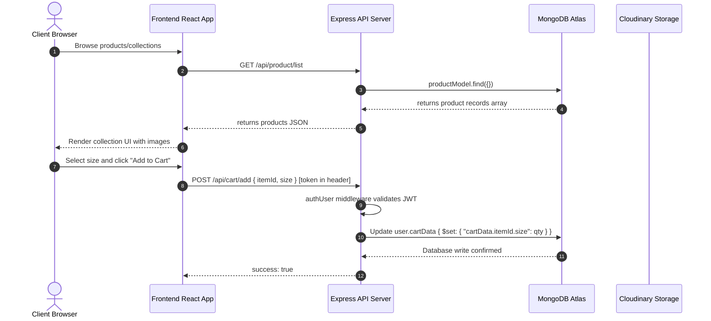
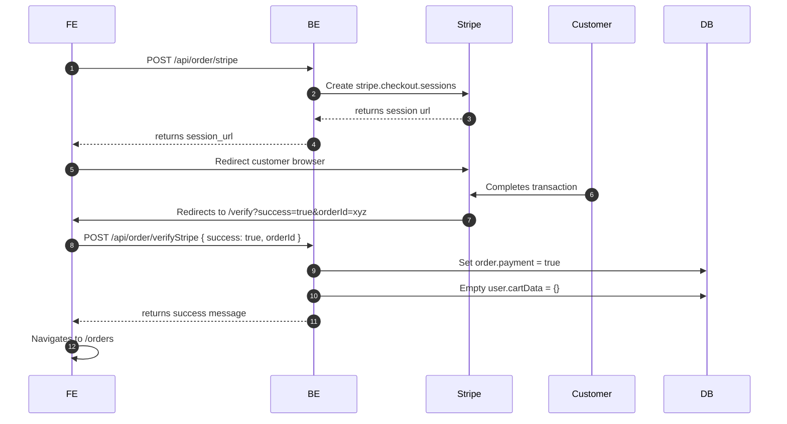

# System Architecture & Technical Specifications (devdocs.md)

This document provides a technical deep-dive into the architectural patterns, build pipelines, database optimizations, security mechanisms, and payment integrations of the **Etoffe de Luxe** MERN application.

---

## 🏗️ System Architecture & Data Flow

Etoffe de Luxe follows a decoupled client-server architecture with stateful database persistence and cloud asset management:



---

## 🛠️ Tech Stack & Deep Technical Rationale

### 1. Frontend: React 19 + Vite 8
*   **Vite vs. Create React App (CRA)**: CRA relies on Webpack, which compiles the entire application before starting the dev server. Vite leverages native ES Modules (ESM) in the browser, compiling code on-demand, and uses `esbuild` (written in Go) for pre-bundling dependencies. This reduces hot module replacement (HMR) times from seconds to milliseconds.
*   **React 19 Rendering**: Uses React 19's optimized rendering and state updates. Local caching and React Router v7 routes handle clean rendering without component re-mounts.
*   **Context API for Global State Management**: Local states are lifted to `ShopContext.jsx` to avoid prop-drilling. Functions like `addToCart`, `updateQuantity`, and `getCartAmount` are computed reactively on the client and immediately synced with the backend databases.

### 2. Styling: Tailwind CSS v4
*   **Rust-based Compiler Engine**: Tailwind CSS v4 replaces the JavaScript-based PostCSS compilation process with a Rust-based compiler engine.
*   **CSS-First Configuration**: Tailwind v4 removes `tailwind.config.js` entirely. Theme definitions, custom utilities, and variants are declared directly inside the stylesheet using CSS custom properties:
    ```css
    @import "tailwindcss";
    @theme {
      --color-primary: #aa3bff;
      --font-outfit: "Outfit", sans-serif;
    }
    ```
*   **Glassmorphism Effects**: Implemented using Backdrop Blur utilities (`backdrop-blur-md bg-white/95`) which tap into native CSS sub-pixel filtering for premium performance.

### 3. Database: Mongoose 9 & MongoDB Atlas
*   **Non-Relational Schema Flexibility**: E-commerce catalogs have highly variable properties (e.g. dimensions, colorways). Storing these properties as JSON documents avoids complex relational SQL tables.
*   **Preserving Empty Schema Nodes**: In Mongoose, empty objects (`{}`, if any) are minimized and removed by default to save storage. For user carts, we explicitly set `{ minimize: false }` to ensure cart initializations (`cartData: {}`) are kept:
    ```javascript
    const userSchema = new mongoose.Schema({
        name: { type: String, required: true },
        email: { type: String, required: true, unique: true },
        password: { type: String, required: true },
        cartData: { type: Object, default: {} }
    }, { minimize: false })
    ```
*   **Index Optimizations**: The `email` field is designated as `unique: true`, creating a B-tree index in MongoDB to guarantee lightning-fast $O(log(N))$ lookup queries on user logins.

### 4. Cloud Asset Host: Cloudinary
*   **Multipart/Form-Data Handling**: Express does not natively parse multipart file streams. We use **Multer** to intercept file inputs, cache them temporarily in server-side disk storage, and stream them asynchronously to Cloudinary using standard API endpoints.

---

## 🔀 API Endpoint Specifications

The Express server exposes the following endpoints under `/api/`:

| Path | Method | Headers | Body Parameters | Middleware | Description |
| :--- | :--- | :--- | :--- | :--- | :--- |
| `/api/user/register` | `POST` | None | `name, email, password` | None | Validates formats, hashes password with Bcrypt (salt round: 10), saves user, and yields JWT. |
| `/api/user/login` | `POST` | None | `email, password` | None | Compares hashed credentials and yields JWT session token. |
| `/api/user/admin` | `POST` | None | `email, password` | None | Validates credentials against `.env` admin variables and yields admin JWT. |
| `/api/product/list` | `GET` | None | None | None | Retrieves all products from database. |
| `/api/product/add` | `POST` | `token` | `name, description, price, category, subCategory, sizes, bestseller, image1...4` | `adminAuth`, `multer` | Uploads multipart images to Cloudinary and saves product document. |
| `/api/product/remove`| `POST` | `token` | `id` | `adminAuth` | Deletes product matching ID. |
| `/api/cart/get` | `POST` | `token` | None | `authUser` | Fetches active user's cartData. |
| `/api/cart/add` | `POST` | `token` | `itemId, size` | `authUser` | Adds/increments item quantity in user's cart. |
| `/api/cart/update` | `POST` | `token` | `itemId, size, quantity` | `authUser` | Modifies item size quantity in cart. |
| `/api/order/place` | `POST` | `token` | `address, items, amount` | `authUser` | Creates COD order and empties user's cart. |
| `/api/order/stripe` | `POST` | `token` | `address, items, amount` | `authUser` | Places Stripe order, maps items, and returns Checkout URL. |
| `/api/order/verifyStripe`| `POST` | `token` | `success, orderId` | `authUser` | Verifies success query param. Sets payment to true and clears cart. |
| `/api/order/list` | `POST` | `token` | None | `adminAuth` | Lists all customer orders for administrative lookup. |
| `/api/order/status` | `POST` | `token` | `orderId, status` | `adminAuth` | Modifies delivery status (e.g. Packing, Shipped). |

---

## 🔒 Security & DNS Resolution Protocols

### 1. Authentication Handshake
*   **JSON Web Tokens (JWT)**: Customer tokens encode `{ id: user._id }` signed by the private `JWT_SECRET` key. Admin tokens encode the concatenated email and password (`process.env.ADMIN_EMAIL + process.env.ADMIN_PASSWORD`).
*   **Authorization Middlware Flow**:
    ```text
    Request Headers (token) ──► authUser/adminAuth ──► jwt.verify() ──► req.body.userId ──► Controller
    ```

### 2. URL Percent-Encoding for MongoDB Connection Strings
If connection passwords contain special characters (such as `#` and `@`), they must be URL-encoded (e.g. `Deployment#@563123` becomes `Deployment%23%40563123`). Failing to encode special characters will cause connection failures because the `@` symbol is interpreted by the MongoDB driver as the credentials separator.

### 3. Programmatic DNS Resolvers (The ECONNREFUSED Fix)
Some local networks or ISP DNS servers restrict SRV records (`_mongodb._tcp` queries) used by MongoDB Atlas. Rather than forcing developers to configure their local operating system DNS settings, Etoffe de Luxe overrides the DNS server settings programmatically for the Node process:
```javascript
import dns from 'dns'
dns.setDefaultResultOrder('ipv4first')
dns.setServers(['8.8.8.8', '8.8.4.4'])
```
This forces Node.js to use Google's Public DNS resolvers to resolve the SRV cluster nodes.

---

## 💳 Payment Gateway Verification Cycles

### 1. Stripe Checkout Session Integration


### 2. Razorpay Orders Integration
*   The backend initiates a transaction by calling `razorpayInstance.orders.create()` passing pricing amount and receipt details.
*   Once the Razorpay SDK yields an order ID, it is sent back to the client.
*   The client initiates the **Razorpay Payment Window** in the browser using the public keys.
*   Upon successful client authentication, the client intercepts the handler callback and calls the backend `/verifyRazorpay` route to set `payment: true` and empty the cart in the database.
